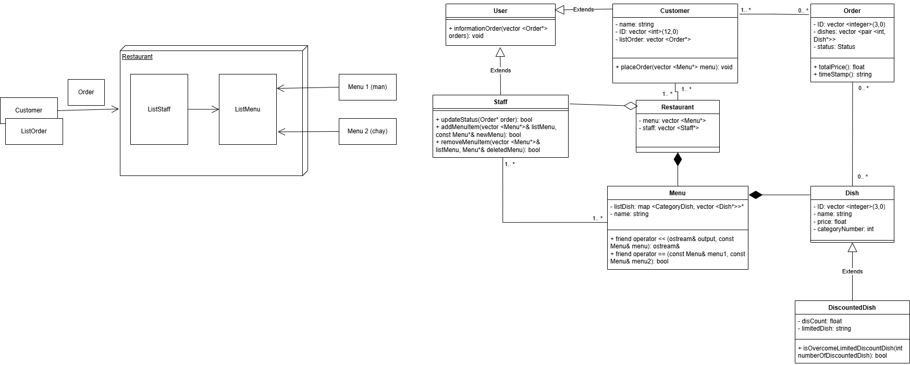

# Project Name
Food Ordering System
## Introduction
Food Ordering System is a C++ console application that describes how working a simple restaurant ordering system.

The system allows customers to view menus, choose dishes, place orders, and check their order information. It also allows staff to manage menus, view customer orders, and update the order status.

**Goal**: Practice OOP in C++, file handling, class design follow **`SOLID principle`**, inheritance, basic order management logic.
## Features
### 1. Customer Features

- View available restaurant menus
- Choose dishes by dish code
- Select quantity for each dish
- Place one or more orders
- View order information
- View total price of an order
- Support discounted dishes with limited quantity

### 2. Staff Features

- View customer orders
- Update order status
- Add a new menu
- Remove an existing menu
- Display order details for staff management

### 3. System Features

- Read menu data from `Menu.txt`
- Save new menu data to `Menu.txt`
- Group dishes by category
- Calculate total price with restaurant mission
- Generate random customer IDs and order IDs

## Technologies

- C++
- OOP
- File handling with `fstream`
- SOLID Principle

## Architechture/Flow
### 1. System Flow

```text
Start Program
     ↓
Load menu data from Menu.txt
     ↓
Show main menu
     ↓
User chooses Staff mode or Customer mode
     ↓
Customer places orders / Staff manages orders
     ↓
System displays order information based on User (Staff/Customer) mode
```

### 2. Customer Order Flow

```text
Customer
   ↓
Choose menu
   ↓
Choose dish code and quantity
   ↓
System checks dish information
   ↓
System adds dish to order
   ↓
System calculates total price
   ↓
Customer views order information
```

### 3. Staff Management Flow

```text
Staff
   ↓
View customer orders
   ↓
Update order status
   ↓
Add or remove menu
   ↓
Display updated restaurant information
```

### 4. Class Diagram

## Project Structure
## What I learn?
## Future Improvement
## Author
